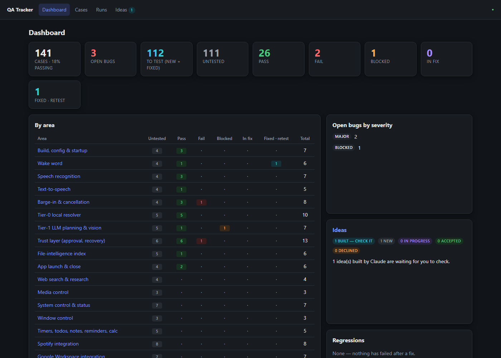
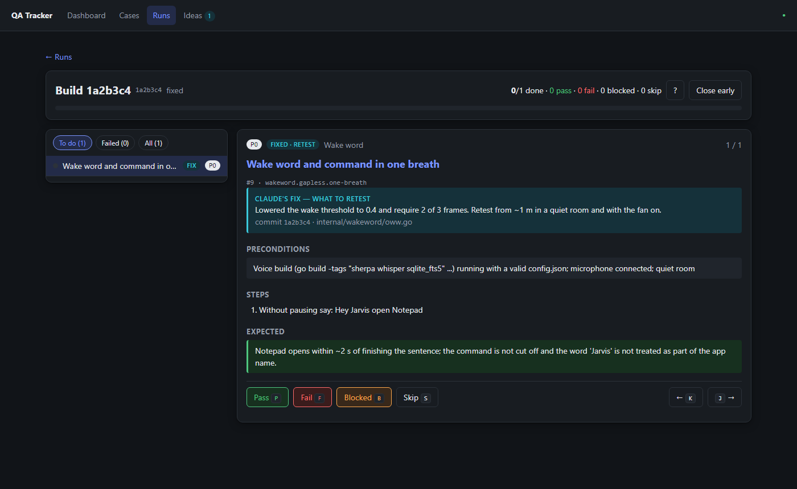
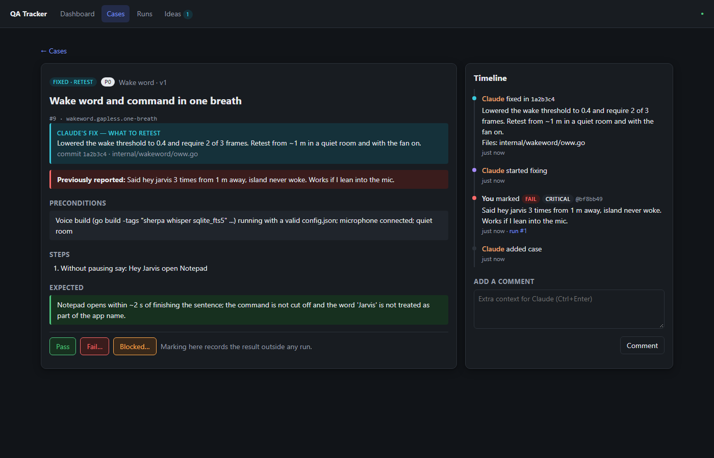
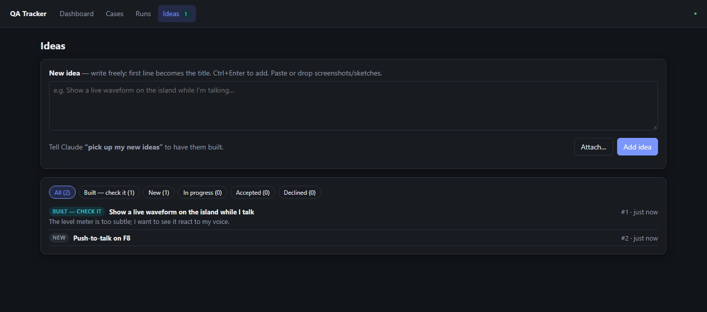
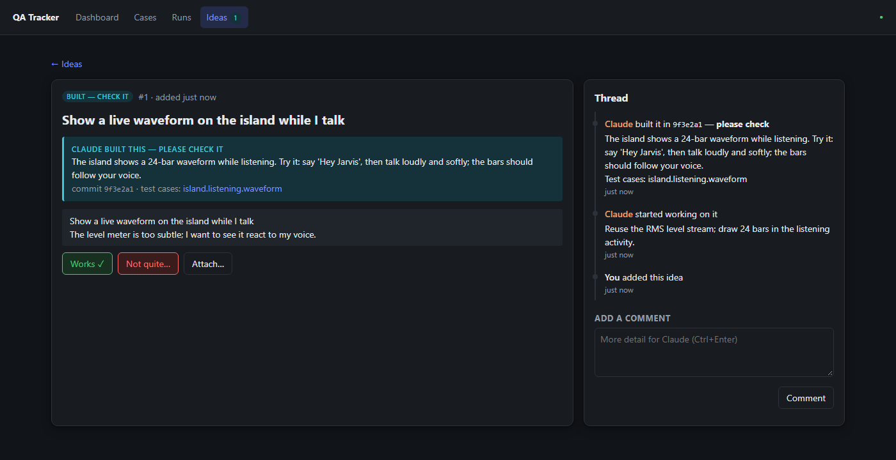

# qa-tracker

**A local, single-binary tracker for manual testing, built so a human tester and an AI coding agent can share one bug-fix loop.**

You run test cases by hand in a fast, keyboard-driven web UI and write down what went wrong. The coding agent ([Claude Code](https://claude.com/claude-code) here, or anything that can run a CLI) reads your failures from the same SQLite database, fixes the code, and records what it changed. You retest only what was fixed. Feature ideas follow the same loop.



- **One binary, no setup.** Go and pure-Go SQLite: no CGO, no Node, no Docker. `qa serve` and you're testing.
- **Built for the test → fix → retest loop.** Each failure carries your remarks, severity, screenshots and logs. Each fix carries a note on what changed and what to retest, plus the commit and files.
- **Regressions are flagged.** A case that fails again after a fix is reopened, counted and highlighted.
- **Nothing is lost.** Every result, fix, comment and test-case edit goes on an append-only timeline, and old versions of test cases are kept.
- **Test cases live in your repo as JSON.** Import them by stable key; editing a case's steps automatically sends it back for retest.

---

## Contents

- [The loop](#the-loop)
- [Screenshots](#screenshots)
- [Quick start](#quick-start)
- [Writing test cases](#writing-test-cases)
- [Ideas](#ideas)
- [CLI reference](#cli-reference)
- [How it works](#how-it-works)
- [Development](#development)

## The loop

```
          ┌──────────────── you (web UI) ────────────────┐      ┌──────── agent (CLI) ────────┐
 suite ──▶│ run cases → Pass / Fail + remarks + screenshots│ ──▶ │ qa bugs → claim → fix code  │
 .json    │                                               │      │ qa fixed --note --commit    │
          │ retest run (only fixed cases, with fix notes) │ ◀── │                             │
          │   pass → closed     fail → reopened/regression│      └─────────────────────────────┘
          └───────────────────────────────────────────────┘
```

| Case status | Meaning |
|---|---|
| `untested` | new, or its steps changed since the last run |
| `pass` | works |
| `fail` / `blocked` | open bug, with your remarks |
| `in_fix` | the agent is working on it |
| `fixed` | the agent says it's fixed; **needs your retest** |

A new run picks **"fixed"** cases by default, so after a round of fixes you retest exactly those.

## Screenshots

**Run player:** one case at a time. `P` pass, `F` fail, `B` blocked, `S` skip, `J`/`K` to move. Fixed cases show the agent's note on what to retest.



**Case timeline:** your report, the agent's claim and fix (with commit and files), attachments, and comments both ways.



**Ideas:** write a feature idea freely; the agent builds it and you confirm it works.




## Quick start

Requires Go 1.26+.

```bash
git clone https://github.com/eshwar2111/qa-tracker.git
cd qa-tracker
go build -ldflags="-s -w" -o qa.exe ./cmd/qa      # use -o qa on macOS/Linux

./qa.exe project add my-app --name "My App" --repo /path/to/my-app
./qa.exe import suites/voice-agent.json          # or your own suite (see below)
./qa.exe serve                                   # → http://127.0.0.1:7777
```

On Windows, `start.cmd` starts the server and opens the browser.

**Testing:**
1. Go to **Runs → Start run**, enter the build or commit you're testing, and choose which cases to include.
2. Work through the cases with the keyboard.
3. When you fail a case, a drawer opens. Write what you saw, choose a severity, and paste a screenshot (Ctrl+V) or drop in a log file. Submit with Ctrl+Enter. Drafts survive closing the drawer.

**Fixing:** tell your agent to *"pick up the bugs"*. It runs `qa bugs`, fixes each one, and records the fix with `qa fixed`. The UI checks for changes every 3 seconds and shows a notice when fixes land.

**Retesting:** start a new run. It contains only the fixed cases, each with the fix note above its steps.

> The server binds to `127.0.0.1` only. It is a local, single-user tool with no authentication.

## Writing test cases

Test cases are JSON files kept in version control, usually under `suites/`:

```json
{
  "project": "my-app",
  "areas": [{ "key": "auth", "name": "Sign-in", "order": 1 }],
  "cases": [{
    "key": "auth.login.happy-path",
    "area": "auth",
    "title": "Sign in with a valid password",
    "priority": "P0",
    "tags": ["smoke"],
    "preconditions": "A user exists: demo@example.com / hunter2",
    "steps": ["Open /login", "Enter the credentials", "Press Sign in"],
    "expected": "Dashboard loads within 2 s and shows 'Hi, Demo'"
  }]
}
```

`qa import suites/my-app.json` adds or updates cases, matching them by `key`:

| What changed | Effect |
|---|---|
| a new key | case created as `untested` |
| `steps`, `expected` or `preconditions` | **new version**; the old one is kept and the case returns to `untested` |
| only `title`, `priority`, `tags` or `area` | updated in place; status kept |
| key missing from the file + `--archive-missing` | archived |

The whole import is checked before anything is written. An unknown area, a bad priority or a duplicate key rejects the file, and the error lists every offending key.

## Ideas

The **Ideas** tab is a free-text inbox for feature ideas. Type an idea and press Ctrl+Enter; the first line becomes the title, and you can paste sketches or screenshots.

```
new ──pick──▶ in_progress ──done──▶ done ──"Works ✓"──▶ accepted
 ▲                 │                  │
 └── "Not quite…" ─┴──── declined ◀───┘   (reopening needs your remarks)
```

Tell your agent to *"pick up my new ideas"*:
1. It runs `qa ideas` and builds each idea.
2. It adds test cases for the new behaviour.
3. It marks the idea `done` with notes on how to try it.

A nav badge counts ideas waiting for you to check.

## CLI reference

All commands print JSON (easy for agents to parse) unless you add `--table`. Flags can come before or after positional arguments.

| Command | Purpose |
|---|---|
| `qa serve [--addr 127.0.0.1:7777]` | web UI + REST API |
| `qa project add <key> [--name] [--repo]` / `project list` | projects |
| `qa import <file.json> [--archive-missing]` / `qa export [--out f]` | sync test cases |
| `qa list [--status s1,s2] [--area] [--priority] [--q]` | find cases |
| `qa bugs [--status] [--area]` | open bugs, worst first, with remarks, attachments, comments and last fix |
| `qa case show <id\|key>` | a case + full timeline |
| `qa claim <id\|key>...` | mark bugs as being fixed |
| `qa fixed <id\|key>... --note "…" [--commit] [--files a,b]` | send back for retest |
| `qa comment <id\|key> "text"` | add context |
| `qa run new [--build] [--filter fixed\|needs-retest\|open\|all\|area:x\|priority:P0]` | start a run |
| `qa run list` / `run show <id>` / `run close <id>` | runs |
| `qa ideas [--status]` | ideas to work on |
| `qa idea show\|add\|pick\|done\|decline\|comment …` | move an idea along |
| `qa summary` | dashboard numbers |

**Database location:** the `--db` flag, then the `QA_DB` environment variable, then `qa.db` next to the binary. Attachments go in `attachments/` beside the database.

### Using it with an AI agent

[`CLAUDE.md`](CLAUDE.md) holds the steps a coding agent follows for *"pick up the bugs"* and *"pick up my new ideas"*. In short:

1. Read with `qa bugs` or `qa ideas`.
2. `claim` or `pick` before starting.
3. Fix or build, and commit.
4. Record it with `qa fixed` or `qa idea done`, plus a concrete note on how to verify.

Any agent that can run shell commands can follow the same steps.

## How it works

```
cmd/qa/            single binary: `serve` or a CLI subcommand
internal/store/    every business rule, and the only package that writes SQL
                   (status machine, import/versioning, runs, events, attachments)
internal/server/   thin JSON REST API + embedded UI
internal/cli/      thin CLI over the store (actor = agent)
web/static/        vanilla HTML/CSS/JS SPA, embedded with go:embed, no build step
suites/            test-case JSON (the example suite covers a Windows voice agent)
```

- **SQLite in WAL mode**, with `busy_timeout` and immediate transactions. The UI server and the CLI can write to the same file at the same time.
- **An append-only `event` table** is both the history of every case and idea and the cursor the UI polls (`GET /api/events?since=<id>`) for live updates.
- **Attachments are content-addressed** (`attachments/<sha256>.<ext>`), limited to 20 MB, and served with `nosniff`. Uploaded text and HTML is always served as plain text.
- **Older databases upgrade automatically** when opened.

The full design is in [`docs/superpowers/specs/`](docs/superpowers/specs/2026-10-08-qa-tracker-design.md).

## Development

```bash
go test ./...                                 # store, HTTP and end-to-end CLI tests
go vet ./...
go build -ldflags="-s -w" -o qa.exe ./cmd/qa
```

- The UI is plain JavaScript in `web/static/`. Edit it, rebuild, and reload; there's no bundler.
- On Windows, stop a running `qa.exe serve` before rebuilding, because the binary is locked while it runs.

## License

[MIT](LICENSE)
